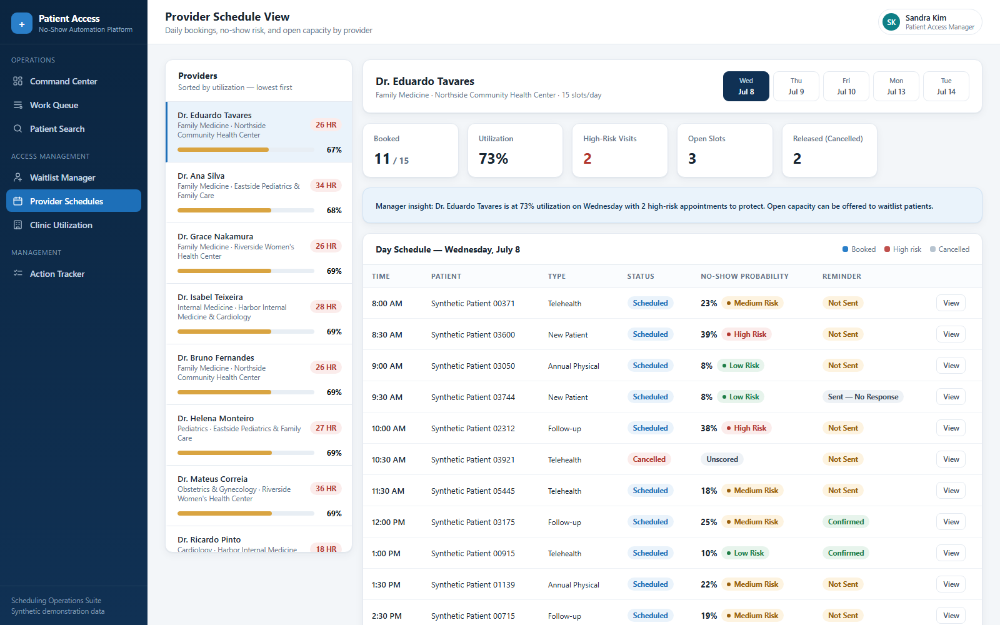
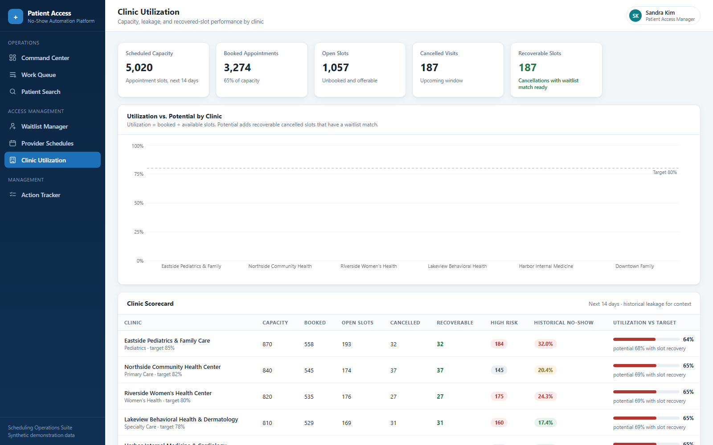
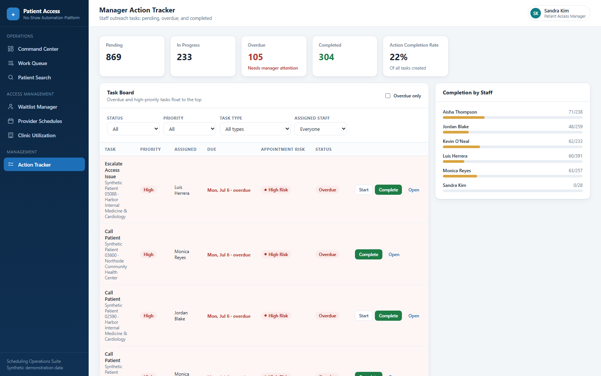
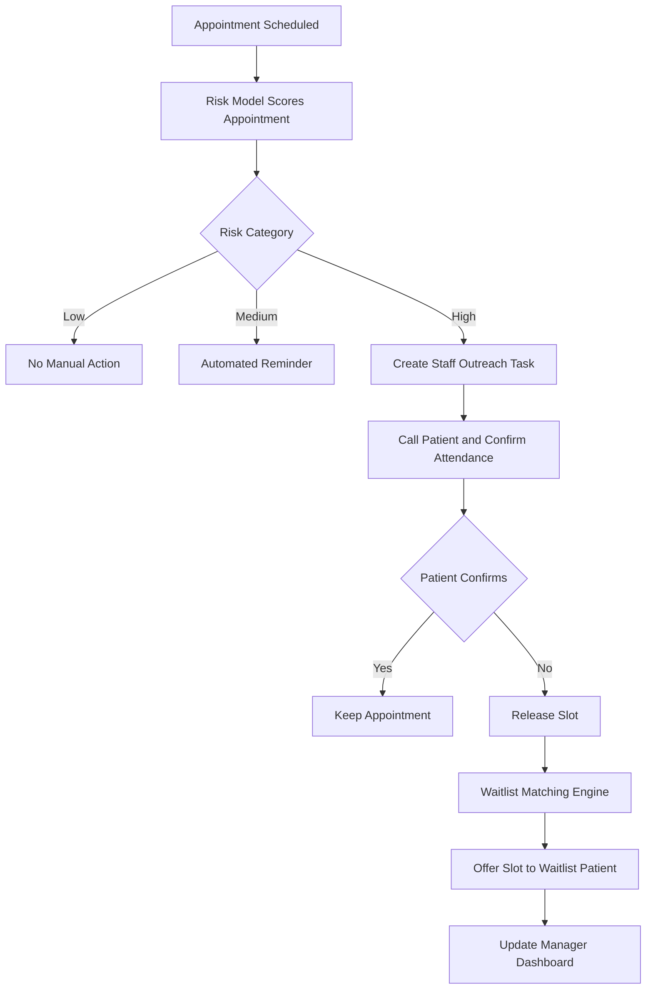

# 🏥 Patient Access & No-Show Automation Platform

> **An end-to-end decision-support system that predicts appointment no-show risk, prioritizes waitlist patients, recommends staff actions, and gives clinic managers real-time scheduling visibility.**

<p>
  
  
  
  
  
  
  
  
</p>
<p>
  <a href="https://github.com/Darshita-dp/Patient-Access-No-Show-Automation-Platform/actions/workflows/ci.yml"></a>
  
  
  
</p>

**The product story:** `Prediction → Risk category → Recommended action → Staff task → Waitlist match → Manager dashboard`

**Built for:** Healthcare Business Analyst · Patient Access Analyst · Product Analyst · Digital Transformation Analyst · Healthcare Data Analyst · BI Analyst


<p align="center"><em>Command Center — the morning operational view for a patient access team.</em></p>

> 🎬 **Demo Walkthrough** — a 60–90 second tour with a speaker script and a
> screen-by-screen checklist, for LinkedIn or interview screens:
> [docs/demo_walkthrough.md](docs/demo_walkthrough.md).

---

## 📋 Project Status

**Portfolio-ready v1: healthcare patient access analytics and automation platform.**

The analytics, prediction, decision-logic, backend, and frontend layers are fully
implemented and runnable end to end. The Microsoft reporting and automation layers
are delivered as **design specifications and mocks** — the honest scope is below.

| Component | Status |
|---|---|
| Healthcare patient-access problem framing | ✅ Complete |
| Synthetic appointment dataset | ✅ Complete |
| Python ETL and feature engineering | ✅ Complete |
| Temporal model evaluation | ✅ Complete |
| Three-model comparison | ✅ Complete |
| Risk categorization | ✅ Complete |
| Recommended-action engine | ✅ Complete |
| Waitlist-matching engine | ✅ Complete |
| FastAPI backend | ✅ Complete |
| React operational application | ✅ Complete |
| Power BI reporting layer | 📐 Design / spec / mock |
| Power Automate-style workflow | 📐 Specification / simulation |
| Fairness analysis | 📝 Portfolio-level audit on synthetic data (see [docs/fairness_audit.md](docs/fairness_audit.md)); production audit on real data is future work |
| Automated tests | ✅ Complete — 101 pytest tests covering ETL, risk categories, action engine, waitlist matching, and API health |
| GitHub Actions CI | ✅ Complete — Python tests + frontend production build |
| License | ✅ Complete — MIT License |

> **Scope note.** This repository does not contain a completed `.pbix` file, and no
> live Microsoft 365 tenant, SharePoint, Outlook, Teams, or SMS integration is
> included in this version. The Power BI and Power Automate layers are documented
> as reporting-layer and workflow designs intended for future implementation.

### ✅ Quality & Validation

- **101 automated pytest tests** — ETL cleaning, risk category thresholds,
  recommended-action engine, waitlist-matching engine, and the FastAPI health
  endpoint. Verified with mutation testing that the tests actually catch
  regressions in each covered rule.
- **GitHub Actions CI workflow** ([`.github/workflows/ci.yml`](.github/workflows/ci.yml))
  runs on every push and pull request.
- **Frontend production build validation** — `vite build` runs in CI so the
  React app cannot silently break.
- **API health endpoint validation** — `/health` returns non-empty table
  counts for appointments, risk scores, open slots, waitlist, and tasks, and
  is asserted by both the test suite and the live app.
- **Portfolio-level fairness audit on synthetic data**
  ([`docs/fairness_audit.md`](docs/fairness_audit.md)) — subgroup metrics
  across gender, age band, clinic, scholarship status, and risk category, with
  disparities documented honestly rather than certified away.
- **MIT License** — see [`LICENSE`](LICENSE).
- **Synthetic data / no PHI** — all patient records are generated by the ETL
  pipeline; no real patient information is present anywhere in the repository.

---

## Table of Contents

1. [Executive Summary](#1-executive-summary)
2. [Business Problem](#2-business-problem)
3. [Solution Overview](#3-solution-overview)
4. [Target Users](#4-target-users)
5. [System Architecture](#5-system-architecture)
6. [Dataset & Data Model](#6-dataset--data-model)
7. [Machine Learning Approach](#7-machine-learning-approach)
8. [Risk Scoring Logic](#8-risk-scoring-logic)
9. [Recommended Action Engine](#9-recommended-action-engine)
10. [Waitlist Matching Logic](#10-waitlist-matching-logic)
11. [Power BI Reporting Layer (Design & Mock)](#11-power-bi-reporting-layer-design--mock)
12. [React Application](#12-react-application)
13. [Workflow Automation (Specification & Simulation)](#13-workflow-automation-specification--simulation)
14. [Before / After Process Map](#14-before--after-process-map)
15. [Results & Simulated Impact](#15-results--simulated-impact)
16. [Skills Demonstrated](#16-skills-demonstrated)
17. [Future Enhancements](#17-future-enhancements)

---

## 1. Executive Summary

Roughly **1 in 5 outpatient appointments ends in a no-show**. Each miss wastes
$150–$200 of provider capacity, delays care for waitlisted patients, and drags
clinic utilization below target — while scheduling teams work reactively from
static schedules and uniform reminders.

This project is a **decision-support system for healthcare scheduling
operations**, not just a model. The full product story:

**Prediction → Risk category → Recommended action → Staff task → Waitlist match → Manager dashboard**

- A scikit-learn model scores every upcoming appointment (0.72 ROC-AUC on a
  strict temporal holdout); the **top-20% risk band captures 45% of all
  no-shows at ~2× base-rate precision**.
- A rules-based **action engine** converts each score into a concrete staff
  step (call, targeted SMS, escalation, transportation check) with a
  plain-language reason.
- A **waitlist matching engine** ranks replacement candidates for every open
  or released slot so cancelled capacity gets refilled instead of expiring.
- A **React operations app** (8 views) and a **FastAPI backend** (21 endpoints)
  put all of it in front of scheduling staff, while a **Power BI reporting-layer
  design** (7-page specification, documented DAX measures, and mock executive
  visuals generated from project data) and a **Power Automate-style workflow
  specification** cover the management and automation layers as design artifacts.

Everything runs locally from synthetic data with one command chain — no
external services required.

## 2. Business Problem

Healthcare teams struggle with appointment no-shows, waitlist gaps, manual
scheduling, poor access visibility, underused provider schedules, and
inconsistent staff follow-up. Missed appointments create unused provider
time, delay care for other patients, reduce clinic utilization, and make
scheduling operations reactive instead of proactive.

The platform answers the questions a patient access team asks every morning:

- Which appointments are most likely to become no-shows?
- Which high-risk patients need outreach **today**?
- Which open slots can be filled from the waitlist?
- Which providers have low utilization? Which clinics leak the most access?
- Which staff actions are pending, completed, or overdue?
- Are reminders reducing no-show risk? What changed before vs. after automation?

Full analysis: [docs/business_case.md](docs/business_case.md)

## 3. Solution Overview

A digital system that helps healthcare scheduling teams identify high-risk
appointments, act before the slot is lost, fill open slots faster, and give
managers visibility into patient access performance.

| Layer | Deliverable |
|---|---|
| Data | Python ETL, synthetic operational tables, PostgreSQL schema + views + KPI queries |
| Prediction | No-show model (LogReg / RF / GB compared), risk thresholds, model card |
| Decision | Recommended-action engine + waitlist matching engine |
| Operations | FastAPI backend (21 endpoints) + React scheduling team app (8 views) |
| Management *(design layer)* | Power BI 7-page reporting-layer specification + DAX measures + mock visuals; Power Automate-style workflow specification |
| Documentation | Case study README, data dictionary, model card, process maps, ERD |

## 4. Target Users

| Role | Daily use |
|---|---|
| **Scheduling staff** | Work the prioritized queue, send reminders, log contact outcomes |
| **Patient access manager** | Track task completion, overdue escalations, waitlist placement |
| **Clinic operations leader** | Monitor utilization vs. target, no-show leakage, recovered slots |

## 5. System Architecture

```
Raw Appointment Data
        ↓
Python ETL + Feature Engineering              ── implemented
        ↓
PostgreSQL Healthcare Access Database         ── implemented (15 tables)
        ↓
No-Show ML Model                              ── implemented
        ↓
Risk Scores + Action Recommendations          ── implemented
        ↓
FastAPI Backend                               ── implemented (21 endpoints)
        ↓
React Scheduling Team App                     ── implemented (8 views)
        ↓
Power BI Executive Dashboard                  ── design / spec / mock
        ↓
Power Automate / SharePoint Task Workflow     ── specification / simulation
```

The platform connects patient access data, predictive modeling, operational
rules, and dashboard reporting into one workflow that supports scheduling
staff and healthcare managers. Detailed diagram:
[diagrams/architecture_diagram.md](diagrams/architecture_diagram.md)

## 6. Dataset & Data Model

**Base dataset:** [Kaggle Medical Appointment No Shows](https://www.kaggle.com/datasets/joniarroba/noshowappointments)
(`PatientId, AppointmentID, Gender, ScheduledDay, AppointmentDay, Age,
Neighbourhood, Scholarship, Hipertension, Diabetes, Alcoholism, Handcap,
SMS_received, No-show`). If the Kaggle file is not present,
`etl/load_raw_data.py` generates a **synthetic dataset with the identical
schema and realistic behavioral patterns** (lead-time effects, reminder
effects, per-patient behavior, ~20% no-show rate), so the entire platform
runs without any download. Drop `KaggleV2-May-2016.csv` into `data/raw/` to
use the real data instead.

Because a flat historical extract can't power an operations platform, the ETL
also generates **synthetic operational tables**: 6 clinics, 36 providers with
daily capacities, a booked 14-day forward schedule with genuine open slots,
170 waitlist requests, 16k+ reminder events, and staff users.

**PostgreSQL data model** (15 tables): patients, providers, clinics,
specialties, appointments, appointment_status_history, open_slots,
waitlist_requests, waitlist_match_results, reminder_events, risk_scores,
recommended_actions, access_tasks, staff_users, date_dim — plus reporting
views and 15 KPI queries in [sql/](sql/). ERD:
[diagrams/data_model_erd.md](diagrams/data_model_erd.md) · Column reference:
[docs/data_dictionary.md](docs/data_dictionary.md)

## 7. Machine Learning Approach

Notebooks: [01 exploration](notebooks/01_data_exploration.ipynb) ·
[02 feature engineering](notebooks/02_feature_engineering.ipynb) ·
[03 model](notebooks/03_no_show_prediction_model.ipynb) (executed, with
outputs). Production entry point: `models/train_model.py`.

- **Features (18):** age, gender, lead_time_days, sms_received, condition
  flags, day-of-week/month/hour, clinic & provider, appointment type,
  reminder count, and **leakage-safe history** — patient_previous_no_shows,
  patient_no_show_rate, clinic_no_show_rate, provider_no_show_rate, all
  computed from strictly earlier appointments.
- **Split:** temporal 80/20 (train on the first 25,600 appointments by date,
  test on the most recent 6,400) — mirrors production scoring.
- **Models compared** (test period, F1-optimal threshold chosen on train):

| Model | ROC-AUC | Recall | Precision | F1 | Accuracy |
|---|---|---|---|---|---|
| **Logistic Regression** ✓ | **0.720** | 0.614 | 0.332 | 0.431 | 0.685 |
| Random Forest | 0.717 | 0.585 | 0.338 | 0.428 | 0.697 |
| Gradient Boosting | 0.709 | 0.577 | 0.341 | 0.428 | 0.701 |

Logistic regression wins on AUC *and* is the most explainable to operations
and compliance stakeholders — an easy call. Metrics are deliberately
realistic; no suspicious 0.98 AUCs. Top drivers: lead time, prior no-show
history, age, social-program flag, reminder status.

**Why recall matters most:** in healthcare operations, missing a likely
no-show costs an unused provider slot; flagging one extra patient costs a
30-second reminder call. The operating point favors catching true no-shows.
Full details and fairness discussion: [docs/model_card.md](docs/model_card.md)

## 8. Risk Scoring Logic

Probabilities become **operational categories** using training-distribution
percentiles (`models/risk_thresholds.json`):

| Category | Rule | Meaning for staff |
|---|---|---|
| Low | bottom 50% | No manual action |
| Medium | 50th–80th percentile | Automated reminder |
| High | top 20% | Human outreach |

This makes the model operational because staff capacity is limited. The
system identifies the highest-priority outreach group instead of asking staff
to contact everyone — and the top-20% band captures **45% of all actual
no-shows** at **40% precision** (vs. a 19.9% base rate).

## 9. Recommended Action Engine

**The model predicts risk, but the action engine translates that risk into
operational next steps for scheduling staff.** ([api/services/action_engine.py](api/services/action_engine.py))

| Condition | Action |
|---|---|
| High risk + ≥50% personal no-show history | Escalate to access team for direct outreach |
| High risk + mobility need + within 72h | Confirm transportation and attendance |
| High risk + within 48 hours | Call patient directly and confirm attendance |
| High risk + no SMS sent | Send SMS reminder and create staff follow-up task |
| Medium risk + within 72 hours | Send automated reminder |
| Low risk | No manual action needed |
| Cancelled slot + waitlist available | Match waitlist patient |
| Provider utilization below 75% | Review open slots (manager task) |
| Clinic no-show rate above target | Escalate to manager |

Every recommendation ships with an `action_reason` in plain language, and
human-needed actions become **assigned, due-dated staff tasks** in the Action
Tracker.

## 10. Waitlist Matching Logic

For every open or released slot, [api/services/waitlist_matching.py](api/services/waitlist_matching.py)
ranks eligible waitlist patients (same specialty, compatible clinic):

```
waitlist_priority_score =
      urgency_score            × 0.35
    + days_waiting_score       × 0.25
    + availability_match_score × 0.20
    + low_no_show_risk_score   × 0.15
    + same_provider_score      × 0.05
```

Deliberate business logic: waitlist filling does **not** chase high-risk
patients — it prefers high urgency, long wait, strong availability fit, and
**low** no-show risk, because the goal is to fill the slot with someone
likely to attend. Each match carries a human-readable reason, e.g.:

> *Matched because patient requested the same specialty, has urgent clinical
> priority, has waited 18 days, and is available during the open appointment
> window.*

## 11. Power BI Reporting Layer (Design & Mock)

> **Scope:** Power BI implementation is documented as a **reporting-layer design
> and mock, not a completed `.pbix` file.** This section delivers Power BI-ready
> KPI definitions, DAX measures, and dashboard layout documentation.

Designed a **seven-page Power BI reporting layer** with documented DAX measures
and dashboard specifications — page-by-page layout in
[powerbi/dashboard_design_spec.md](powerbi/dashboard_design_spec.md), complete
DAX measure set in [powerbi/README.md](powerbi/README.md):

1. Executive Summary · 2. No-Show Risk Analysis · 3. Clinic Utilization ·
4. Provider Schedule Performance · 5. Waitlist & Access Gaps ·
6. Staff Action Tracker · 7. Before/After Automation Impact

The specification is built against the star-schema views in [sql/](sql/), so the
model can be pointed at the same PostgreSQL layer the app uses. Mock executive
visual, **generated programmatically from this project's data** (not a Power BI
export):


KPIs covered: total/completed appointments, no-show rate, cancellation rate,
risk-band counts, open/recovered slots, clinic & provider utilization,
average lead time, average waitlist days, pending/overdue tasks, reminder and
action completion rates.

## 12. React Application

Eight operational views with a professional healthcare SaaS design — sidebar
navigation, KPI cards, risk badges, readable tables, empty/loading/error
states, and action buttons wired to the API.

| View | What staff do there |
|---|---|
| **Command Center** | Today's KPIs, high-risk outreach list, slots with matches, manager alerts |
| **Appointment Work Queue** | Filter by risk/clinic/provider/date/task/reminder; send reminders, create tasks, mark contacted |
| **Patient / Appointment Search** | Find any visit by ID, name, clinic, provider, date, or risk |
| **Appointment Detail** | Patient summary, risk explanation, recommended action, reminder history, prior behavior, waitlist replacement, staff notes |
| **Waitlist Manager** | Open slots with ranked candidates; offer / accept / decline / skip |
| **Provider Schedule** | Day-by-day bookings with risk, open slots, and manager insights |
| **Clinic Utilization** | Capacity vs. booked vs. potential (with slot recovery) per clinic |
| **Action Tracker** | Task board with priorities, overdue flags, and per-staff completion |

**Appointment Work Queue** — the prioritized daily worklist with risk badges, recommended actions, and inline outreach controls:


**Appointment Detail** — why this appointment is risky, what to do about it, and the one-click waitlist replacement:


**Waitlist Manager** — open slots matched to ranked, ready-to-attend candidates with human-readable match reasons:


**Provider Schedule** — day-by-day utilization, open slots, and high-risk flags per provider:


**Clinic Utilization** — booked vs. potential capacity and recovered-slot opportunity across clinics:


**Action Tracker** — the manager's task board with priorities, overdue flags, and per-staff completion:


## 13. Workflow Automation (Specification & Simulation)

> **Scope:** This is a **Power Automate-style workflow specification and
> simulation**. The outreach loop is simulated using local API state transitions
> (reminder sent → task created → task completed / escalated). **No live
> Microsoft 365 tenant, SharePoint, Outlook, Teams, or SMS integration is
> included in this version** — the flow logic is documented for future
> Microsoft 365 implementation.

**This workflow simulates how a patient access team could automate outreach
and escalation for high-risk appointments.**

- Trigger: appointment scored **High Risk**, within the next **72 hours**
- Actions: ① send reminder → ② create staff follow-up task → ③ update the
  SharePoint task list → ④ notify the scheduling manager if not completed
  within 24 hours

Specs and diagrams: [workflows/high_risk_outreach_workflow.md](workflows/high_risk_outreach_workflow.md)
and [workflows/workflow_documentation.md](workflows/workflow_documentation.md),
plus a mock SharePoint task list extract
([workflows/sharepoint_task_list_mock.csv](workflows/sharepoint_task_list_mock.csv))
generated from the platform's real task data.



## 14. Before / After Process Map

**Before:** appointment sits on the schedule → generic reminder maybe →
patient no-shows → slot wasted → staff finds gaps manually → waitlist patient
contacted too late → manager sees it after the fact.

**After:** appointment data flows into the platform → risk scored → category
and action assigned → high-risk visits create outreach tasks → reminder/call
workflow triggers → open slots matched to the waitlist → manager tracks
utilization and completion in real time.

Full maps: [diagrams/before_process_map.md](diagrams/before_process_map.md) ·
[diagrams/after_process_map.md](diagrams/after_process_map.md)

## 15. Results & Simulated Impact

**Measured model results** (synthetic data, temporal holdout): 0.72 ROC-AUC;
high-risk band = 20% of appointments capturing 45% of no-shows at 40%
precision (~2× base rate).

**Simulated operational impact** — based on synthetic workflow assumptions,
**not real hospital results**:

| Metric | Before | After |
|---|---|---|
| No-show rate | 18.5% | 14.2% |
| Manual outreach hours/week | 22 | 9 |
| Recovered open slots/week | 4 | 17 |
| High-risk appointments contacted | 35% | 82% |
| Average waitlist days | 21 | 14 |

## 16. Skills Demonstrated

Healthcare operations analytics · patient access workflow analysis ·
predictive modeling · feature engineering · classification model evaluation ·
SQL data modeling · PostgreSQL · Python ETL · FastAPI backend development ·
React frontend development · Power BI reporting-layer design · DAX measure
authoring · KPI definition · workflow automation design · process mapping ·
product thinking · business analyst documentation · operational KPI design

## 17. Future Enhancements

**Closing the design-vs-implementation gap** (the items marked design/spec above):

- **Build the actual `.pbix` Power BI dashboard** from the existing seven-page
  specification and DAX measure set, connected to the PostgreSQL views
- **Implement a live Power Automate cloud flow** using SharePoint and Outlook
  (and an SMS connector) to replace the simulated outreach loop
- **Repeat the fairness audit on real target-population data** — a
  portfolio-level audit on synthetic data ships with the repo
  (`models/fairness_audit.py`, [docs/fairness_audit.md](docs/fairness_audit.md))
  and already surfaces age-band and clinic disparities that would need
  addressing (e.g. group-aware thresholds) before any production use
- **Add a deployment option** for the API and frontend (containerized, with a
  hosted demo environment)
- **Add a role-based access mockup** separating scheduling staff from manager
  views, plus an audit trail on every staff action
- **Add production-grade governance and security** — authentication, secrets
  management, request-level audit logging, data-retention policies, and PHI
  handling controls appropriate to a live health-system deployment

**Product and modeling roadmap:**

- **Scheduling-system integration** (HL7v2 SIU / FHIR Appointment) to replace
  CSV ingestion with live feeds
- **Model upgrades:** calibrated gradient boosting and SHAP-based
  per-appointment explanations
- **Two-way patient messaging** with self-service rescheduling that feeds the
  waitlist engine automatically
- **Overbooking recommendations** that pair predicted no-show volume with
  provider-level overbook tolerances
- **A/B measurement framework** to replace simulated before/after numbers
  with a real stepped-wedge rollout analysis

---

### Repository guide & quick start

```
etl/          load_raw_data → clean_appointments → generate_synthetic_tables → feature_engineering → load_to_postgres
models/       train_model.py · score_appointments.py · model + thresholds + metrics
api/          FastAPI app · routes/ · services/ (action engine, waitlist matching)
frontend/     React app (Vite) — 8 operational views
sql/          schema · seed · views · KPI queries
notebooks/    3 executed notebooks (exploration, features, model)
powerbi/      dashboard design spec · DAX · before/after simulation
workflows/    Power Automate specs · SharePoint task list mock
diagrams/     architecture · ERD · before/after process maps (Mermaid)
docs/         business case · model card · data dictionary · implementation notes · screenshots
```

**Option A — Docker (single command, recommended for reviewers)**

```bash
docker compose up --build
# API      -> http://localhost:8000  (Swagger UI at /docs)
# Frontend -> http://localhost:5173
```

Runs in CSV mode; no database required. To add the optional PostgreSQL
instance (seeded from `sql/`), use the compose profile:

```bash
docker compose --profile postgres up --build   # + Postgres on :5432
```

**Option B — Standard local setup (no Docker)**

```bash
pip install -r requirements.txt
python etl/load_raw_data.py && python etl/clean_appointments.py
python etl/generate_synthetic_tables.py && python etl/feature_engineering.py
python models/train_model.py && python models/score_appointments.py
uvicorn api.main:app --port 8000          # API + Swagger at /docs
cd frontend && npm install && npm run dev  # app at :5173
```

Setup details and design decisions: [docs/implementation_notes.md](docs/implementation_notes.md)

### Disclaimer

*All patient data in this repository is synthetic — no PHI is present, and patient
names are generated placeholders. Operational impact figures in §15 are simulated
from synthetic workflow assumptions and are **not** real hospital results. The
Power BI and Power Automate layers are design specifications and mocks rather than
a completed `.pbix` file or a deployed Microsoft 365 flow. The model is built for
portfolio and synthetic-data demonstration only; it is not validated for clinical
or production deployment. A portfolio-level subgroup fairness audit is included
on synthetic data ([docs/fairness_audit.md](docs/fairness_audit.md)); a production
fairness audit on real target-population data remains future work (see
[docs/model_card.md](docs/model_card.md)).*
