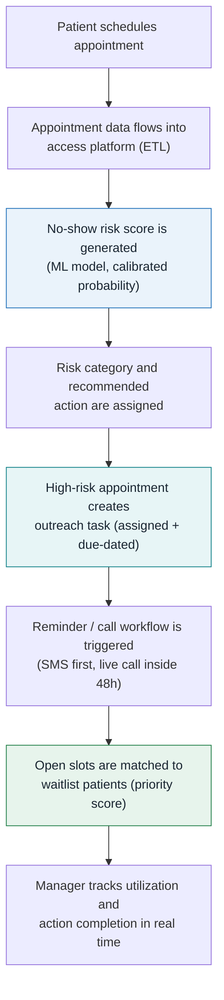

# After Automation — Proactive Patient Access Process

Risk is scored at booking, work is prioritized automatically, and released
slots are refilled from the waitlist before they expire.

**What changed:** outreach capacity concentrates on the top-20% risk band,
reminders escalate by risk instead of being uniform, cancellations
immediately produce ranked waitlist offers, and the manager dashboard shows
pending work — not just last month's losses.
