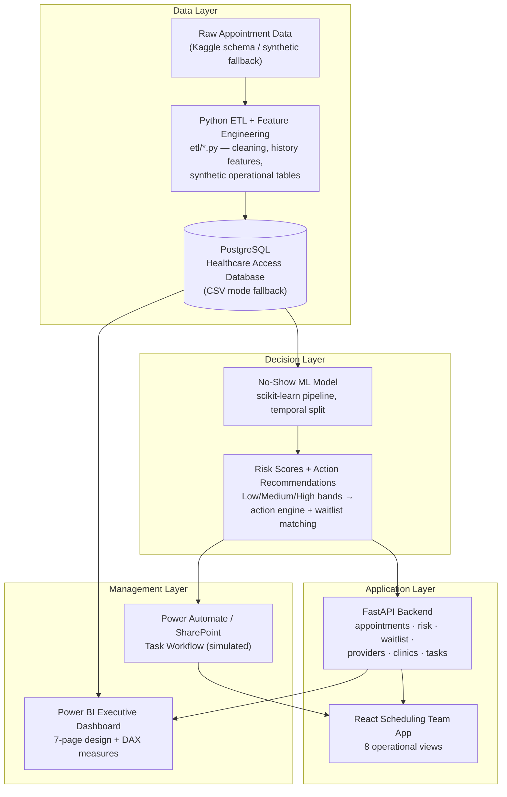

# System Architecture

The platform connects patient access data, predictive modeling, operational
rules, and dashboard reporting into one workflow that supports scheduling
staff and healthcare managers.



## Component responsibilities

| Component | Responsibility |
|---|---|
| `etl/` | Ingest raw appointments, clean to snake_case, engineer leakage-safe features, generate providers/clinics/waitlist/reminders/schedule tables |
| `sql/` | PostgreSQL schema, reporting views, KPI queries |
| `models/` | Train and compare classifiers, persist model + risk thresholds, score upcoming appointments |
| `api/services/` | Recommended-action rules and waitlist priority scoring |
| `api/` | REST endpoints for every operational view; CSV-mode data store |
| `frontend/` | Scheduling team application (Command Center → Action Tracker) |
| `powerbi/` | Executive dashboard design, DAX, before/after simulation |
| `workflows/` | Power Automate flow specs + SharePoint task list mock |
```
