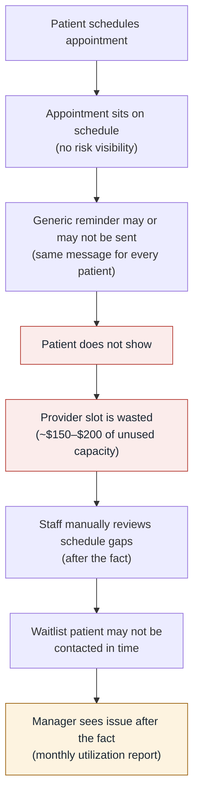

# Before Automation — Reactive Scheduling Process

Every step is manual, and problems are discovered **after** the slot is
already lost.

**Failure modes:** no prioritization of outreach, reminder effort spread
evenly across low- and high-risk patients, released slots discovered too late
to refill, and managers reporting on losses instead of preventing them.
