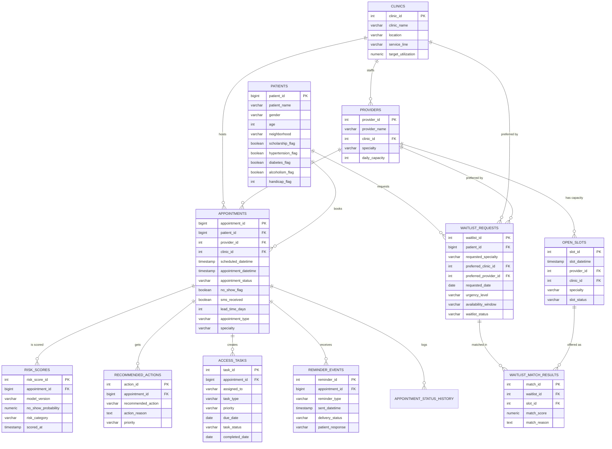

# Data Model — Entity Relationship Diagram

PostgreSQL schema (`sql/01_schema.sql`). Star-friendly: `appointments` is the
central fact; model outputs and workflow tables hang off it one-to-many.

Supporting tables not shown: `specialties`, `staff_users`, `date_dim`
(reporting dimension for Power BI).
