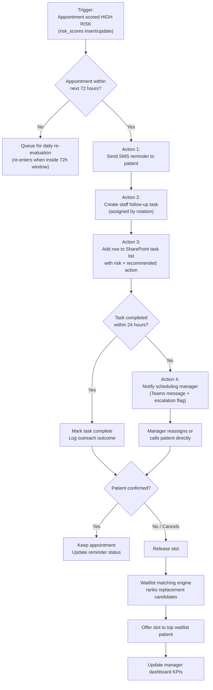

# High-Risk Appointment Outreach Workflow

This workflow simulates how a patient access team could automate outreach and
escalation for high-risk appointments using Power Automate + SharePoint on top
of the platform's risk scores.

## Trigger

| Property | Value |
|---|---|
| Trigger | When an appointment is scored as **High Risk** |
| Source | `risk_scores` table (new/changed row, `risk_category = 'High'`) |
| Frequency | Near-real-time (on scoring run), plus daily 6:00 AM sweep |

## Condition

Appointment date is within the **next 72 hours** (`appointment_datetime <=
utcNow() + 72h`). High-risk visits outside the window re-enter the flow when
they cross into it.

## Actions

1. **Send reminder message** — SMS to the patient with confirm / reschedule
   options; response is written back to `reminder_events`.
2. **Create staff follow-up task** — task type from the recommended-action
   engine (Call Patient / Send Reminder / Confirm Transportation / Escalate),
   assigned round-robin to patient access coordinators.
3. **Update SharePoint task list** — one row per task (see
   `sharepoint_task_list_mock.csv`) so the access team works from a familiar
   surface.
4. **Notify scheduling manager if not completed within 24 hours** — an
   escalation flag is set and the manager is notified with the appointment's
   risk context.
